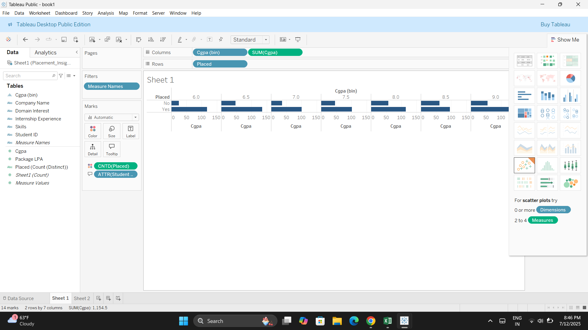
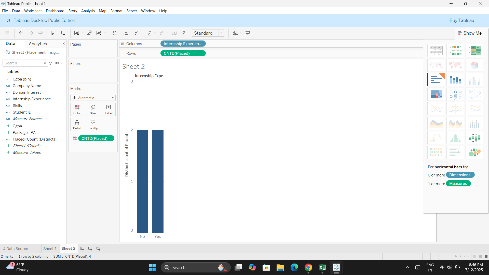

# 🎓 Campus Placement Insights Dashboard

This project analyzes simulated student placement data to uncover insights around CGPA, skills, internships, and domain interests using Tableau.

## 📊 Dashboard Features

- Placement rate by CGPA range
- Internship experience vs placement success
- Domain interest trends
- Company-wise average packages
- CGPA vs Package scatter analysis
- Interactive filters for slicing data by domain, internship, and placement status

## 🔧 Tools Used

- **Tableau Public**
- **Excel** (data simulation)
- **Python** (optional preprocessing)

## 📁 Dataset

Simulated student data with 150+ records containing:
- CGPA
- Skills
- Domain Interest
- Internship Experience
- Placement Outcome
- Company and Package Offered

## 📸 Screenshots

| CGPA vs Placement | Internship vs Placement |
|------------------|--------------------------|
|  |  |

## 📎 Key Insight

> "Students with higher CGPA and internship experience had significantly better placement outcomes."

## ✅ Status

✔️ Completed  
📌 Published on Tableau Public (Optional)

## 💡 Author

**Yashika Arya**  
[LinkedIn](https://linkedin.com/in/yashika-arya) | [GitHub](https://github.com/yashikaarya43)
